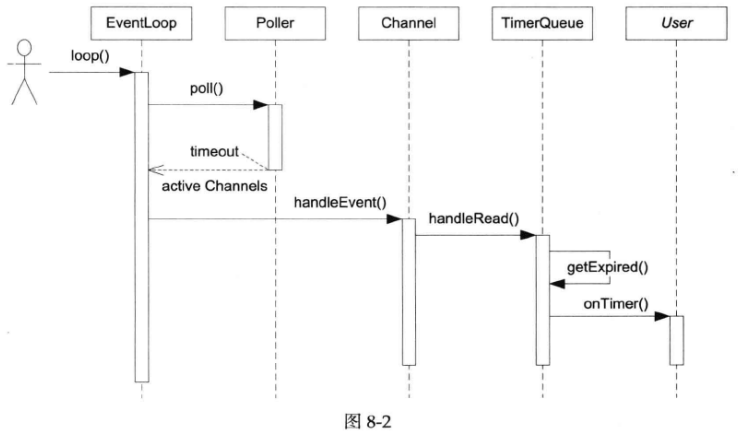

# webserver-cpp

## webserver-1.0

    webserver-1.0只实现了Reactor的基础框架，作为webserver的入门

    webserver-1.0实现了三个类EventLoop、Poller、Channel，定义了一个定时器，监听该事件，当定时器到期时，会触发事件，并调用相应的回调函数处理事件。  

    webserver-1.0构成了Reactor模式的核心内容，作为webserver的基础框架

    

## webserver-1.1

    webserver-1.1在1.0的基础上实现了定时器功能。

    实现了三个类TimerQueue、Timestamp、Timer

    详见webserver-1.1/README

    