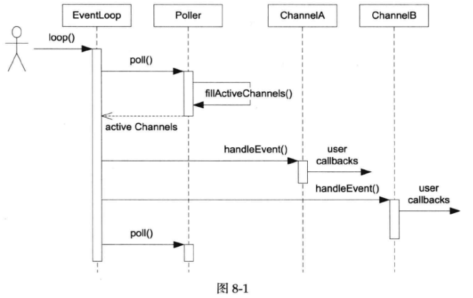

# webserver-1.0
这个版本以muduo库为原型，实现了简单的并发模型，实现了EventLoop、Poller、Channel三个结构体，并运行测试了功能。

这个版本并没有什么功能，只实现了一个框架，还没实现内容，作为一个webserver项目的入门，为后续实现打基础。
   
1. 定义一个EventLoop，用来查询事件
   EventLoop::loop()调用Poller::poll()获得当前活动事件的Channel列表，然后依次调用每个Channel的handleEvent()函数：

2. 定义一个Channel，用来分发事件，设置事件的回调函数
       每个Channel对象自始至终只属于一个EventLoop，因此每个Channel对象都只属于某一个IO线程。每个Channel对象自始至终只负责一个文件描述符（fd）的IO事件分发，但它并不拥有这个fd，也不会在析构的时候关闭这个fd。Channel会把不同的IO事件分发为不同的回调
    Channel::update()会调用EventLoop::updateChannel()，后者会转而调用Poller::updateChannel()
   Channel::handleEvent()是Channel的核心，它由EventLoop::loop()调用，它的功能是根据revents_的值分别调用不同的用户回调。

3. poller class
    poller:poll()是Poller的核心功能，它调用poll(2)获得当前活动的IO事件，然后填充调用方传入的activeChannels，并返回poll(2) return的时刻
    fillActiveChannels()遍历pollfds_，找出有活动事件的fd，把它对应的Channel填入activeChannels
    当前活动事件revents会保存在Channel中，供Channel::handleEvent()使用
    Poller::updateChannel()的主要功能是负责维护和更新pollfds_数组

   