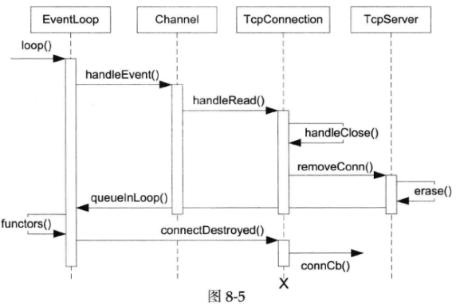

# webserver-1.4

TcpServer class的功能是管理accept(2)获得的TcpConnection。TcpServer是供用户直接使用的，生命期由用户控制，用户只需要设置好callback，再调用start()即可。

TcpServer内部使用Acceptor来获得新连接的fd。TcpServer保存用户提供的ConnectionCallback和MessageCallback，在新建TcpConnection的时候会原样传给TcpConnection。TcpServer持有目前存活的TcpConnection的shared_ptr（定义为TcpConnectionPtr）。

TcpConnection使用Channel来获得socket上的IO事件，它会自己处理writable事件，而把readable事件通过MessageCallback传达给客户。TcpConnection拥有TCP socket，它的析构函数会close(fd)（在Socket的析构函数中发生）。

TcpConnection表示的是“一次TCP连接”，它是不可再生的，建立连接时会新建一个TcpConnection，一旦连接断开，这个TcpConnection对象就没啥用了，会被析构。另外TcpConnection没有发起连接的功能，其构造函数的参数是已经建立好连接的socket fd（无论是TcpServer被动接受还是TcpClient主动发起），因此其初始状态是kConnecting。

Buffer用来处理输入输出

## 流程

### 监听

TcpServer::start() 会调用 Acceptor::listen()，使socket进入监听状态。

### 建立连接 

收到连接会触发Acceptor：：acceptChannel_事件，调用handleRead进行accept，接着调用newConnectionCallback_，
就是TcpServer::newConnection()，这个函数会创建一个TcpConnection，并设置回调函数，调用TcpConnection::connectEstablished。

### 读写数据

TcpConnection中channel_绑定到已建立连接的socket的fd，当接收到数据时，会触发事件，执行TcpConnection::handleRead()，调用read来读取收到的数据。

### 断开连接

如果read返回值是0的话，说明对端断开了连接，调用handleClose（）会调用channel_->disableAll()和closeCallback_，   TcpConnection::closeCallback_在TcpServer中设置，设置为TcpServer::removeConnection，移除列表中的connection，会在removeConnection中执行TcpConnection::connectDestroyed函数，调用loop_->removeChannel(get_pointer(channel_));

TcpConnection是用shared_ptr管理的，在生命周期结束并且无其他所有者时，会自动释放内存。移除的TcpConnection调用析构函数，析构socket，会调用close关闭socket

   

