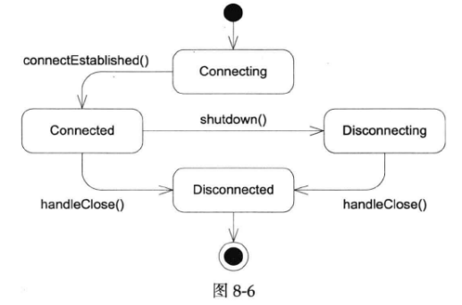

# webserver-1.5

TcpConnection的接口中增加了send()和shutdown()两个函数

使用Buffer作为输出缓冲区。

新增了kDisconnecting状态

实现send、sendInLoop发送功能

当socket变得可写时，Channel会调用TcpConnection::handleWrite()，这里我们继续发送outputBuffer_中的数据。

## SIGPIPE

```
class IgnoreSigPipe
{
public:
    IgnoreSigPipe()
    {
        ::signal(SIGPIPE, SIG_IGN);
    }
};

IgnoreSigPipe initObj;

```

SIGPIPE 信号在 Unix 系统中，当一个进程向一个没有读端的管道写数据时，系统会向该进程发送 SIGPIPE 信号。默认情况下，这个信号会导致进程终止。这样设计是为了通知进程它正在对一个无效的管道操作。

上述代码定义了一个名为 IgnoreSigPipe 的类，在这个类的构造函数中，使用 signal 函数将 SIGPIPE 信号设置为忽略 (SIG_IGN)。这意味着当进程接收到 SIGPIPE 信号时，将不会终止进程，而是直接忽略这个信号。

在网络编程中，当使用套接字进行数据传输时，如果远端关闭了连接，而本地继续发送数据，系统会触发 SIGPIPE 信号。通过忽略 SIGPIPE 信号，可以防止程序因发送数据到关闭的套接字而意外终止，从而让程序可以更优雅地处理这种情况，例如通过检查错误码来判断连接是否断开。假如服务进程繁忙，没有及时处理对方断开连接的事件，就有可能出现在连接断开之后继续发送数据的情况。

## TCP No Delay和TCP keepalive

TCP No Delay和TCP keepalive都是常用的TCP选项，前者的作用是禁用Nagle算法，避免连续发包出现延迟，这对编写低延迟网络服务很重要。后者的作用是定期探查TCP连接是否还存在。一般来说如果有应用层心跳的话，TCP keepalive不是必需的（如果没有应用层心跳，而对方机器突然断电，那么本机不会收到TCP的FIN分节。在没有发送消息的情况下，这个“连接”可能一直保持下去），但是一个通用的网络库应该暴露其接口。

TcpConnection::setTcpNoDelay()  
TcpConnection::setKeepAlive()

   

